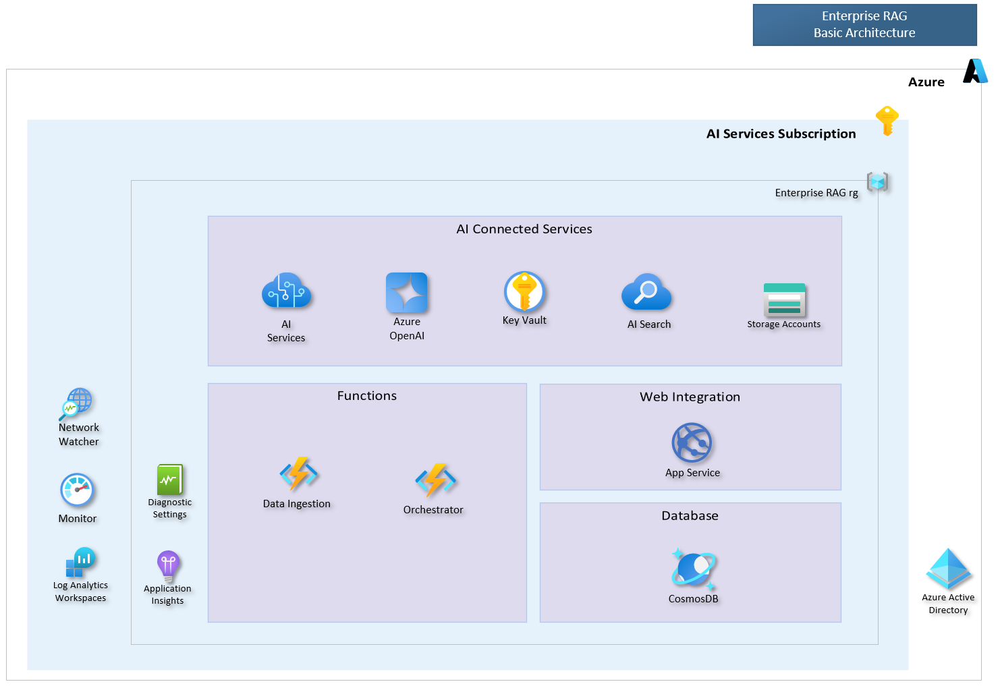
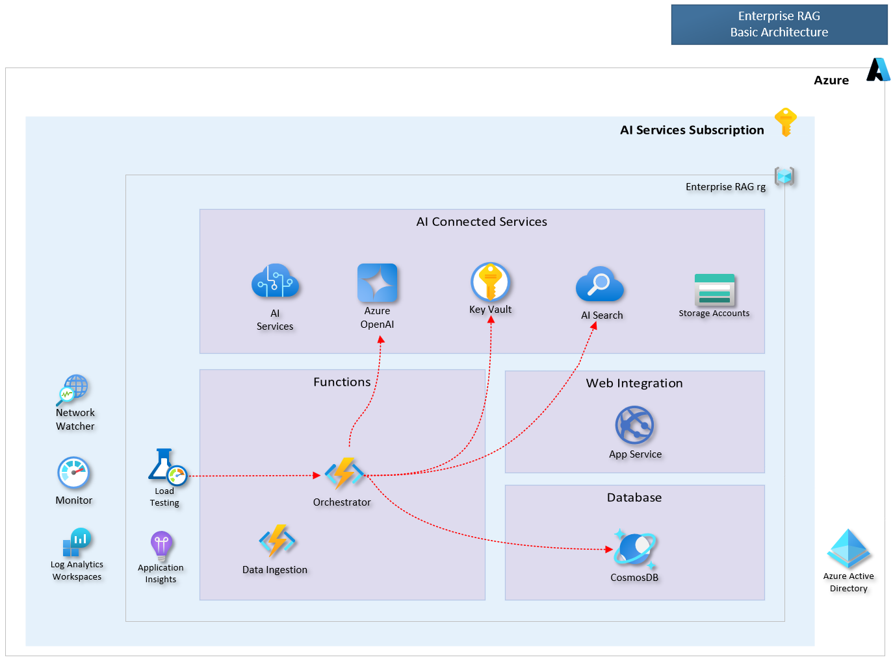
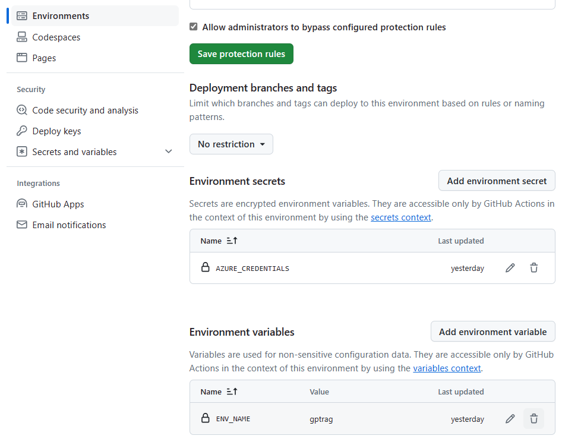
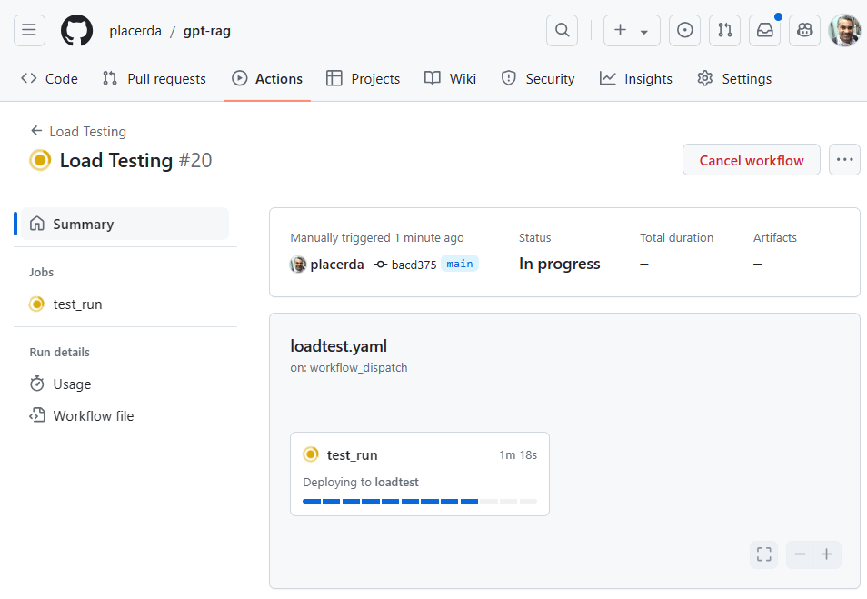
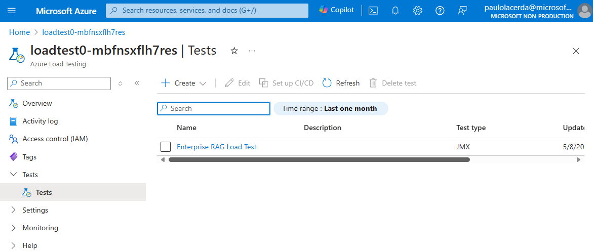

# Load Testing the LLM App Orchestator

This guide outlines how to load test the Enterprise RAG Orchestrator. We'll use Azure Load Testing for test execution and GitHub Actions for control. GitHub Actions workflow enables automation of performance tests in a CI/CD pipeline, aligning with LLMOps practices.

The **Enterprise RAG** Solution Accelerator (GPT-RAG) is a reference implementation of an LLM App, following the RAG pattern. This application utilizes Azure AI services to respond to user queries based on their data indexed in Azure AI search. It comprises three main components: the frontend, the orchestrator, and the data ingestion component. The following diagram illustrates the solution architecture deployed with its Basic configuration.

The orchestrator, an essential component of the solution, is a Python program developed using the Semantic Kernel SDK. It functions as an Azure Function, managing the conversation flow and interfacing with services such as Azure OpenAI and AI Search to respond to user queries. For more information about Enterprise RAG, please visit [this page](https://aka.ms/gpt-rag).

> Note: The test procedure described here is versatile and can be tailored to test the full functionality of the LLM App by directing the load towards the application's frontend. Additionally, it's suitable for testing other orchestration strategies that employ low-code solutions, like Prompt Flow orchestation, or apps that use LLMs beyond Azure OpenAI models.

## Test Scope

This test is mainly centered on the orchestrator component. The goal is to understand the performance of the entire RAG orchestration flow, not just the LLM's response time. This involves measuring several aspects: the time required to fetch the conversation history from the database, the duration of message triage, the time it takes to retrieve documents from AI Search, and the time the GenAI model needs to generate a response. 

Moreover, the response time will also include the time used for final checks like groundedness and fairness, which are done with LLM before the orchestrator sends back the response. This thorough testing method gives us a full view of the performance traits of the entire RAG orchestration process. This way, we can spot potential slowdowns and areas that could be optimized.

## Test Architecture

The diagram below provides an overview of the load testing architecture. It illustrates the components that will be involved during the execution of the test, as indicated by the dashed red arrows originating from the orchestrator. This diagram will help us understand the flow of the load test and identify the components that will be most active and potentially impacted during the test execution.

## Test Scenario

This test is structured to emulate a fundamental scenario, showcasing how you can construct your own test scenario utilizing Azure Load Testing. This test scenario is adaptable and can be tailored to more accurately meet your specific requirements.

To understand the details of the test scenario, it's crucial to know that Azure Load Testing employs the JMeter standard for defining your test scenario. This involves the use of two key files: [`loadtest.jmx`](../loadtest/loadtest.jmx) and [`user.properties`](../loadtest/user.properties). The `loadtest.jmx` file outlines the JMeter test plan, while `user.properties` configures properties like virtual users and test duration.

Upon examining these two files, you'll see that our test simulates 10 virtual testers, each sending a question to the orchestrator component. There's a 10-second delay before the test starts, then it takes 30 seconds for all the testers to be active during the ramp-up period. The test is designed to run for a maximum of 360 seconds. To simulate real users, there's a gap between requests, often referred to as "Think Time" of 1 second, followed by a random delay or "Pause", which ranges between 0 and 1 second.

In simple terms, the test is conducted by sending HTTP requests to a specific endpoint in the orchestrator function. These requests include a user-defined variable `udv_functionKey` that acts as the API Key. During the test, Azure Load Testing fetches this key from the Key Vault. The HTTP request is a POST method aimed at the /api/orc endpoint of the function app. Each request includes a JSON object from this file, which contains a unique conversation_id and a question obtained from a `dataset.csv` file. This file is important because it's where the questions used by the virtual testers are stored.

## Pre-requisites

Before you can execute the load test, there are a few pre-requisites that you need to fulfill:

1. **Azure Subscription**: Please ensure that you have an active Azure subscription.

2. **Enterprise RAG Deployment**: It's necessary to have the Enterprise RAG Solution Accelerator deployed. This deployment also provisions an Azure Load Testing resource, which is essential for conducting the load test. If this hasn't been done yet, please refer to the [Getting Started](https://github.com/Azure/gpt-rag/README.md#getting-started) section. This provides a step-by-step guide on how to deploy the basic architecture of the accelerator.

3. **GPT-RAG Repository**: Please ensure you have a personal copy of the GPT-RAG repository in your GitHub account. You can accomplish this by either forking the [original repository](https://aka.ms/gpt-rag) or creating a new repository using the ["Use this template"](https://github.com/new?template_name=GPT-RAG&template_owner=Azure) option.

Once you have these pre-requisites in place, you are ready to proceed with the load testing.

## Test Setup

To set up the load test, please follow these steps:

1. **Create GitHub Repo Environment**: Start by navigating to your GPT-RAG repository. In the repository's Settings, create a new environment named **loadtest**. This environment will be used to store the secret and the variable needed for the load testing.

2. **Create an Azure Service Principal**: The next step involves creating an Azure Service Principal. This is a security identity used by user-created apps, services, and automation tools to access specific Azure resources. You'll use it to execute the load testing on Azure. Follow steps 1-4 in [this guide](https://github.com/marketplace/actions/azure-load-testing#azure-service-principal-for-rbac) to create your Service Principal. When naming your Service Principal, consider using a unique format like `<your-initials>-gptrag-load-test-cicd` to prevent name conflicts within the same tenant.

> Note: In the third step of the guide, you'll be asked to add a Secret. This Secret should not be added as a general GitHub repository secret. Instead, it should be added as an environment secret specifically within the **loadtest** environment you created earlier. This method ensures that the secret is securely isolated within the **loadtest** environment, enhancing the security of your load testing setup.

3. **Create an ENV_NAME variable**: The last step is to create a variable named ENV_NAME in the GitHub **loadtest** environment. This variable should hold the same value as the name of the environment in Azure Developer CLI (AZD) that you used when deploying the application. By doing this, you ensure that the load test targets the correct instance of your application, and that there's consistency between the environments used for deployment and load testing.

After completing these steps, your GitHub repo **loadtest** environment should look similar to the image below. Note that in my case, the environment name used in Azure DevOps (AZD) is 'gptrag':

With these steps completed, you are now ready to proceed with the load test.

## Running the Test

Executing the tests is a straightforward process. Simply navigate to the Actions tab in your GitHub repository, select the Load Testing workflow, and finally, click on the "Run workflow" button.

The load test will then begin.

## Analyzing Results

Once the test concludes, you can access the results on the Load Testing resource page in the Azure Portal. Simply select "Enterprise RAG Load Test", as shown in the following image:

Next, select the most recent test run, as shown in the following figure. Note that in this example, the test run passed.

> Note: The test in the above example passed because the p95 response time (response_time_ms) was less than 10000ms. The failure criteria for the test are defined in the [`config.yaml`](../loadtest/config.yaml) file.

In addition to the client metrics available on the test page, you can also add App Components such as the Orchestrator Function App and the Azure OpenAI service to view server metrics on the same page, just click on the "App components" in your test run page.

